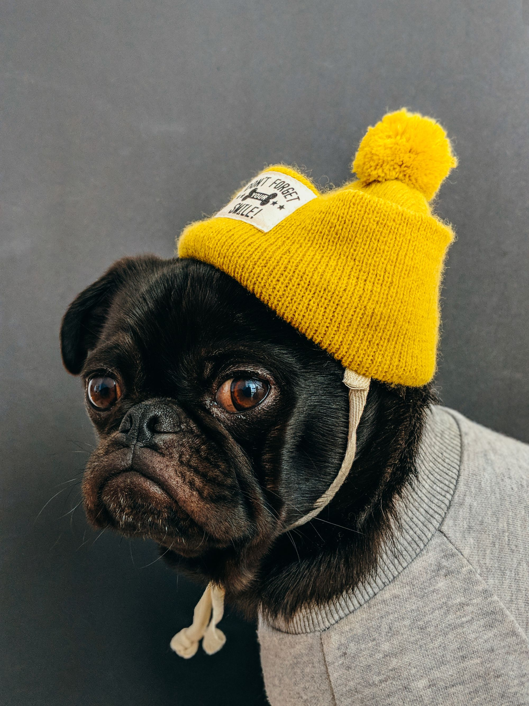

Young people today are making a serious mistake about their fashion style. Speaking of fashion, it sounds like a luxury, and you have to spend a lot of money to buy an item you like to wear, or simply a pair of shoes you would love to buy. Forget it all! I will show you ways you can both save a lot of money and wear clothes that are meaningful to you and sustainable,Style doesn’t come easily for everyone, and that’s totally OK. Not having a distinct sense of style is nothing to be ashamed of, but despite popular belief, style is not so much innate as something you can learn over time—if you so desire.
Defining your look can be intimidating, but it’s much less scary when you have simple steps guiding you along the way. For those of you just starting out, look no further than our five easy steps, and you’ll be styling in no time.

01. Build Up Your Wardrobe with Basics and Investment Pieces
Creating your personal style is so much easier when you already have a strong wardrobe foundation. But what does that even mean? A strong wardrobe foundation will serve as the building blocks to your personal style. These items are typically called “basics,” e.g., jeans and T-shirts, and “investments,” e.g., skirts, slacks, blazers, and blouses. Basic and investment items should be tailored specifically for your body type—the easiest way to guarantee that every outfit will look amazing on you. When trying out new looks and developing your personal style, these base items will serve as the perfect starting point.

02. Watch

The first step to developing your sense of style is to become an expert stalker, er, observer. Turning on your “style brain” might be a bit difficult if you haven’t used it before, but try paying special attention to what the women around you are wearing. What about their outfits do you like or dislike? A good way to tell whether you really like an outfit is when you can imagine yourself wearing it in your everyday life. Can you see yourself going out to drinks in that skinny jeans and blazer combo? If the answer is yes, then jot down this look in your mental personal style book. If you can’t picture yourself wearing it in a common daily activity, then move on.
Because style is so visual, create an inspiration board on Pinterest. Search through celebrities whose style you particularly admire, or simply scroll through your feed for outfits that stand out. Make mental notes about the specific pieces and looks that you are drawn toward. Are they more masculine or feminine? Are the colors bright or muted? Is there a vintage or modern vibe to the looks you like? Start jotting down the specific items that you want to wear together.

03. Copy

“Copying” gets a bad rap. But at the end of the day, everyone (even the greatest fashion icons) were inspired by someone. So don’t feel guilty for recreating someone else’s outfit.

Now that you’ve got your Pinterest board full of outfits you’d like to try, take some extra time in the morning (or the night before) to examine your style board in front of your own wardrobe. As you look at all the outfits on your inspiration board, which items are similar to ones you already own? Start going through your closet and picking out the clothes that match (or are close enough to) your desired outfit. Be flexible as you put together your look—you might not have the exact striped button-up, but a blue one does the same job.

04. Ignore Trends

Most importantly, forget about being “fashionable.” The goal is to create personal style, not to become a slave to trends. Women often associate “fashion” with “style,” but really they are two completely different things. This confusion often results in women thinking that style is superficial and materialistic because of the pressure to be trendy. But really, personal style is all about creating an everyday look and identity that is curated to your personal taste and lifestyle. A personal sense of style is not influenced by the fluctuating tides of fashion.
So forget about what Kendall and Gigi are wearing (please), and focus on items that flatter your body and work with your lifestyle. Each item you incorporate into your wardrobe should represent who you are and should be versatile enough for numerous occasions throughout your week. You should be able to mix and match your items in various ways, and you should never feel pressured to wear something you don’t really like.

05. Try New Things

For those of us embarking on newfound territory, changing our look can be scary. We often feel nervous to wear outfits that are out of the norm. We wonder, “What if people think I look weird?” or “What if this outfit is too out there?” These insecurities are totally normal when stepping outside of your comfort zone. But know that there is a fine line between really disliking something and just being afraid of something new. Give it a try for one wear—if you still really hate it, rethink it. Style should make you feel good about yourself, so if it’s just that you think it’s too much for you, give yourself the freedom to try it out. You might not be used to wearing boyfriend jeans with heels, but if you know you love it on others, at least give yourself a chance.
If you don’t want to pull a 180, start easing into your bolder looks. For example, if the boyfriend jeans and heels combo is too intense, swap the heels for ballet flats. Or if your crimson skirt seems too bright, tone it down with a black top and jean jacket. Over time, by trying new things you’ll find what makes you shine—and that is the ultimate style statement.
