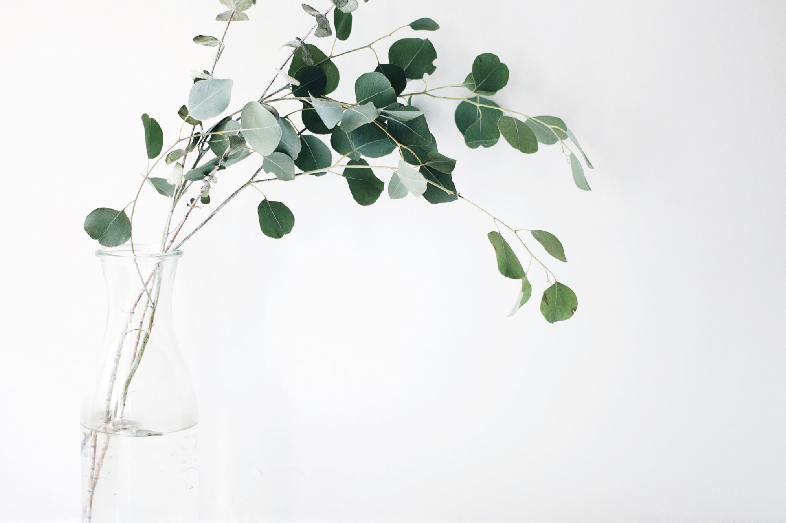

Think beautiful thoughts. The "inner glow" that people find beautiful in others will only be genuine and durable if you have a truly beautiful personality. Have a heart that is in the right place, rather than play-acting. If your self-esteem has taken a battering lately, build it back up. Spread kindness, love and consideration for others in place of wallowing in self-pity and comparison.
Be an attentive listener. Learn to really hear what others have to say and be genuinely interested in their lives, stories, and hopes. People always respond well to people who care and there is great subtle beauty to be found in being heard.

Groom well. Beauty regimes should not take up all of the time but should be straightforward, easy and effective. Invest in quality over quantity - a good hairbrush, a good hair smoothing implement, good makeup, good hair products, etc. When you find something that works, stick with it and keep using it rather than trying too far afield.

Wear simple but elegant and timeless outfits. Rely on a base color, such as black, white, brown, pink, etc., and a single pattern. Quality is always better than quantity. Spend money on clothing items that will last and still look lovely, rather than shelling out cash for cheap styles that will wear out quickly or fade out of fashion fast.

Don't flirt. Learn ways to show appreciation of others that don't include stooping to manipulative or unloving behavior.

Become interdependent. Build up good relationships with other people and be willing to depend on others when need be. Don't be afraid to ask for help- people will appreciate the fact that you can be genuine. Make sure, though, not to infringe on the good-will of your friends unnecessarily.