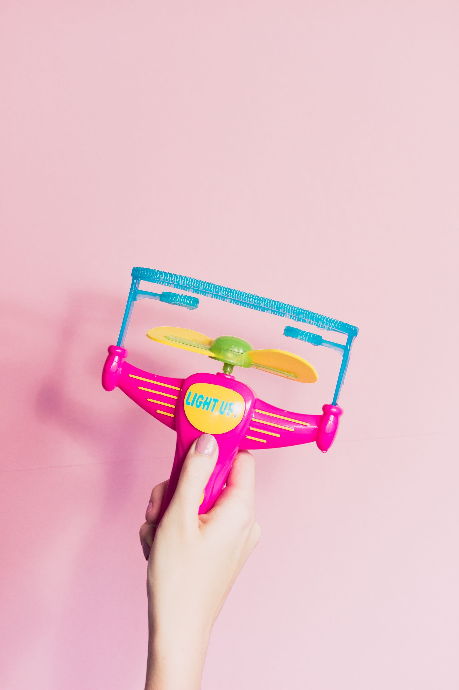

### Picasso had his pink period and his blue period. I am in my blonde period right now.

When I first started wearing pink, it wasn't nothing I planned on doing or strategized. But people showed me so much love for the pink mink I wore, I had to go out to Pantone and create my own color, which is called Killa Pink.

So affection is inherently emotion. It's like a bolt of lightning, coming on tight and going fast. It came suddenly and the fact that it won't tell you exactly at what time? So cherish those who are loving on your side, so that the rays will remain here forever.

